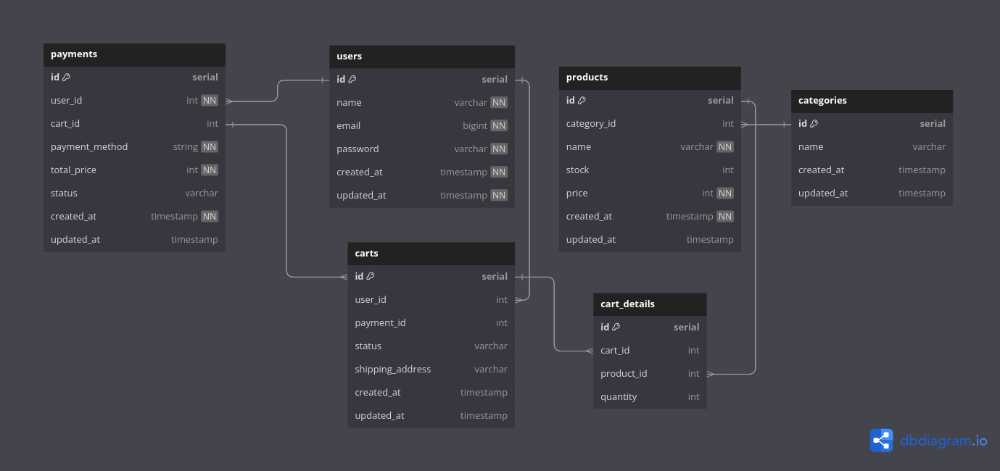

# E-Commerce API

This repository contains an e-commerce API built with Go using the Gin framework. The API supports user authentication, product management, cart management, order processing, and payments.

## Table of Contents

- [Database Structure](#database-structure)
- [Features](#features)
- [Installation](#installation)
- [API Endpoints](#api-endpoints)
- [Request Examples](#request-examples)
- [Testing the Application](#testing-the-application)

## Database Structure

The following Entity Relationship Diagram (ERD) illustrates the database structure for the e-commerce application:



## Features

- User Registration and Authentication
- Product Management (Create, Retrieve)
- Category Management (Create, Retrieve)
- Cart Management (Add, View, Delete Items)
- Order Management (Create, Retrieve)
- Payment Processing (Create, Retrieve)


## Installation

1. Clone the repository:
    ```sh
    git clone https://github.com/yourusername/e-commerce-api.git
    cd e-commerce-api
    ```

2. Install dependencies:
    ```sh
    go mod tidy
    ```

3. Set up your database and update the configuration file with your database credentials.

4. Run database migrations (assuming GORM AutoMigrate is configured).

5. Start the server:
    ```sh
    go run main.go
    ```

## API Endpoints

### User Authentication

- **Register User**
  - **Endpoint**: `POST /api/v1/user/register`
  - **Body**:
    ```json
    {
      "email": "string",
      "password": "string"
    }
    ```

- **Login User**
  - **Endpoint**: `POST /api/v1/user/login`
  - **Body**:
    ```json
    {
      "email": "string",
      "password": "string"
    }
    ```

- **Get User Token**
  - **Endpoint**: `GET /api/v1/user/token`

### Product Management

- **Create Product**
  - **Endpoint**: `POST /api/v1/product/`
  - **Auth**: `Bearer Token`
  - **Body**:
    ```json
    {
      "category_id": int,
      "name": "string",
      "description": "string",
      "stock": int,
      "price": int
    }
    ```

- **Retrieve All Products**
  - **Endpoint**: `GET /api/v1/product/`

- **Retrieve Products by Category**
  - **Endpoint**: `GET /api/v1/product/category/:id`

### Category Management

- **Create Category**
  - **Endpoint**: `POST /api/v1/category/`
  - **Auth**: `Bearer Token`
  - **Body**:
    ```json
    {
      "name": "string"
    }
    ```

- **Retrieve All Categories**
  - **Endpoint**: `GET /api/v1/category/`

### Cart Management

- **Get Cart Info**
  - **Endpoint**: `GET /api/v1/cart/`
  - **Auth**: `Bearer Token`

- **Add to Cart**
  - **Endpoint**: `POST /api/v1/cart/`
  - **Auth**: `Bearer Token`
  - **Body**:
    ```json
    {
      "product_id": int,
      "quantity": int
    }
    ```

- **Delete Cart Detail**
  - **Endpoint**: `DELETE /api/v1/cart/detail/:id`
  - **Auth**: `Bearer Token`

- **Fetch User Carts**
  - **Endpoint**: `GET /api/v1/cart/all`
  - **Auth**: `Bearer Token`

### Order Management

- **Create Checkout**
  - **Endpoint**: `POST /api/v1/checkout`
  - **Auth**: `Bearer Token`
  - **Body**:
    ```json
    {
      "shipping_address": "string",
      "cart_detail_ids": [int]
    }
    ```

- **Get Order Info**
  - **Endpoint**: `GET /api/v1/order`

### Payment Processing

- **Create Payment**
  - **Endpoint**: `POST /api/v1/payment/`
  - **Auth**: `Bearer Token`
  - **Body**:
    ```json
    {
      "payment_method": "string"
    }
    ```

- **Get Payment Info**
  - **Endpoint**: `GET /api/v1/payment/`
  - **Auth**: `Bearer Token`

## Request Examples

### Register
```sh
curl -X POST http://localhost:8080/api/v1/user/register \
  -H "Content-Type: application/json" \
  -d '{
    "email": "example@example.com",
    "password": "password123"
  }'
```

### Login
```sh
curl -X POST http://localhost:8080/api/v1/user/login \
  -H "Content-Type: application/json" \
  -d '{
    "email": "example@example.com",
    "password": "password123"
  }'
```

### Create Category
```sh
curl -X POST http://localhost:8080/api/v1/category/ \
  -H "Content-Type: application/json" \
  -d '{
    "name": "Electronics"
  }'
```

### Create Product
```sh
curl -X POST http://localhost:8080/api/v1/product/ \
  -H "Content-Type: application/json" \
  -d '{
    "category_id": 1,
    "name": "Laptop",
    "description": "A high-end laptop",
    "stock": 50,
    "price": 1000
  }'
```

### Add to Cart
```sh
curl -X POST http://localhost:8080/api/v1/cart/ \
  -H "Content-Type: application/json" \
  -d '{
    "product_id": 1,
    "quantity": 2
  }'
```

### Create Checkout
```sh
curl -X POST http://localhost:8080/api/v1/checkout \
  -H "Content-Type: application/json" \
  -d '{
    "shipping_address": "123 Main St",
    "cart_detail_ids": [1, 2]
  }'
```

### Create Payment
```sh
curl -X POST http://localhost:8080/api/v1/payment/ \
  -H "Content-Type: application/json" \
  -d '{
    "payment_method": "Credit Card"
  }'
```

## Testing the Application

Follow these steps to test the application:

1. **Create an account**
   - Use the `POST /api/v1/user/register` endpoint to create a new user account.

2. **Login with that account**
   - Use the `POST /api/v1/user/login` endpoint to log in and obtain a token.

3. **Create a category**
   - Use the `POST /api/v1/category/` endpoint to create a new product category.

4. **Create a product with category ID**
   - Use the `POST /api/v1/product/` endpoint to create a new product associated with the category.

5. **Add to cart**
   - Use the `POST /api/v1/cart/` endpoint to add a product to the cart.

6. **Delete cart item**
   - Use the `DELETE /api/v1/cart/detail/:id` endpoint to delete a specific cart item.

7. **Create checkout**
   - Use the `POST /api/v1/checkout` endpoint to create a checkout with the cart items.

8. **Create payment**
   - Use the `POST /api/v1/payment/` endpoint to create a payment for the order.

By following these steps, you can test the complete flow of the e-commerce application, from user registration and product management to cart handling, checkout, and payment processing.

### Description

- **Users**: Contains user information.
- **Categories**: Defines product categories.
- **Products**: Holds product details, each linked to a category.
- **Carts**: Represents a user's shopping cart, including the status and shipping address.
- **Cart Details**: Stores individual items within a cart.
- **Payments**: Tracks payment details and links to a cart.

This structure supports the necessary relationships between users, products, categories, carts, and payments, ensuring data integrity and enabling efficient e-commerce operations.
